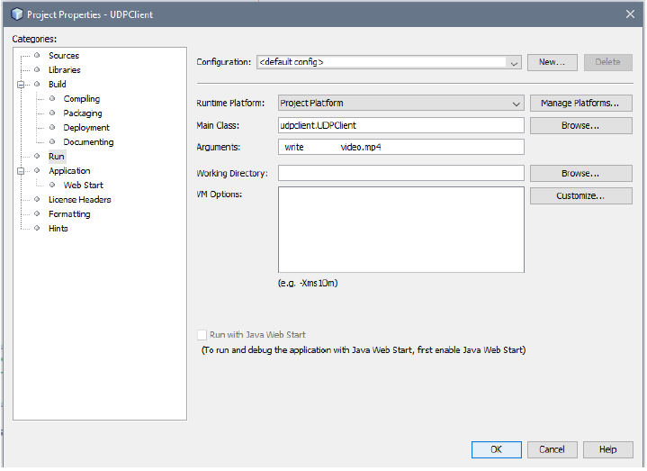

### File-Transfer under implimentation of UDP&TCP 

-------------

### How to use

-------------
For first you wil have to use netbeans or anu IDE that will aloww you to call and change the arguments of the main method, please follow example on netbeans below.

After opening the project for UDPServer/Client or TCPServer/Client check the customize in both UDPClient and TCPClient. Example below

