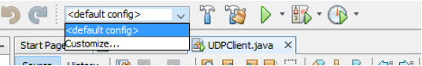

### File-Transfer under implimentation of UDP&TCP 

-------------

### How to use

-------------
For first you will have to use netbeans or any IDE that will aloww you to call and change the arguments of the main method, please follow example on netbeans below.

After opening the project for UDPServer/Client or TCPServer/Client check the customize in both UDPClient and TCPClient.

----

Click on the Customize method and you will see a new window where you can pass your arguments to the client. Example Below

#### Important
----

At the section where it says Arguments you have a line where you can type in your first argument that you want the client to send for example by typing either ‘read’ or ‘write’ and after you can press space and type in the second argument which is going to be the name of the file with its type. To run the TCP you should customize it the same way as for udp. Example of argument in above Diagram.
Note (1) make sure having a space between two argument otherwise it will understand it as a one argument. (2) make sure that requirement should be ‘read’ or ‘write’ with no capitals. (3) Firstly, run the server then only rune the client so that client is able to connect with the server hat is already running
